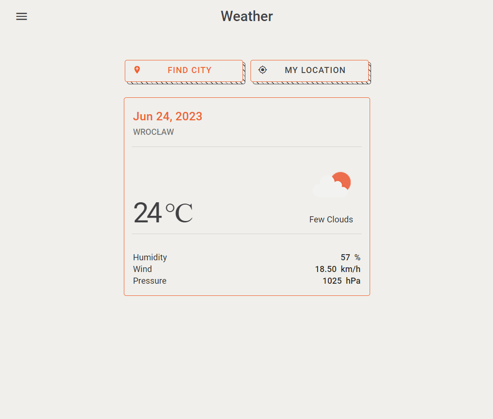
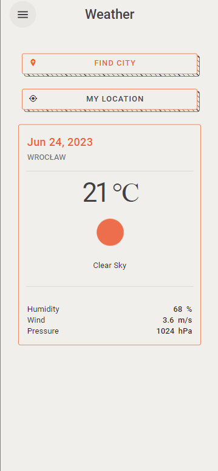
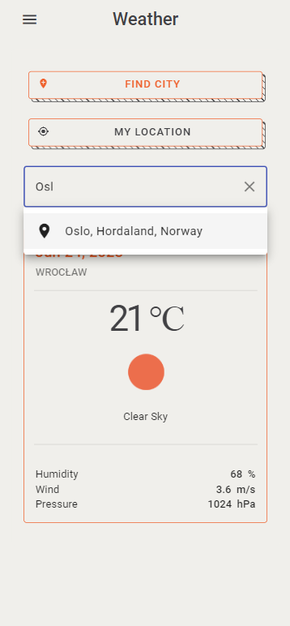
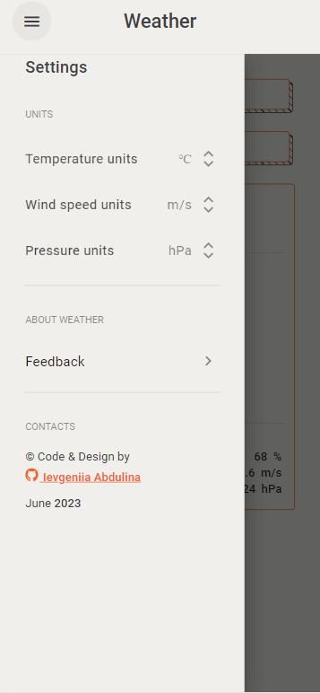

<h1 align="center">Simple Weather Application</h1>

   Project created for practice and improving knowledge of Angular and TypeScript.

  <h3>
    <a href="https://angular-weather-app-six.vercel.app">
      Demo
    </a>
     | 
    <a href="https://github.com/IevgeniiaAbdulina/angular-weather-app">
      Solution
    </a>
     | 
    <a href="https://www.figma.com/file/KHk75LOI8hFeIMXSaZgUxV/Weather-app-2.0?type=design&node-id=0%3A1&t=2VIob8c24rfbU8Jc-1">
      Figma
    </a>
  </h3>

## Table of Contents

- [Overview](#overview)
  - [Built With](#built-with)
- [Features](#features)
- [How to use](#how-to-use)
- [Acknowledgements](#acknowledgements)
- [Contact](#contact)

## Overview

  

  
  
  

- You can try this project just by the link below:
  > [The Angular project has been deployed with Vercel](https://angular-weather-app-six.vercel.app)
- The Weather Application uses the [OpenWeather API](https://openweathermap.org/api) to provide a city's current weather forecast. The app also uses [GeoDB Cities API](https://rapidapi.com/wirefreethought/api/geodb-cities) to Get global city, region, and country data for searching custom cities.
- You can get a weather forecast for your geolocation (allow getting geolocation for your browser).
- You can get a weather forecast for your chosen city.
- You can change a forecast unit's settings.
- You can use this application in a browser and on a mobile screen.

### Built With

A list of major frameworks that I built this project using:

- [Angular CLI 16.0.3](https://angular.io/)
- [Angular Material](https://material.angular.io)
- [RxJS 7.8.1](https://rxjs-dev.firebaseapp.com/guide/overview)
- [TypeScript 5.0.4 ](https://www.typescriptlang.org/)
- [Open weather API](https://openweathermap.org/api)
- [GeoDB Cities](https://rapidapi.com/wirefreethought/api/geodb-cities)

## Features

- Simple interface
- Detailed weather: Date, Temperature, Humidity, Wind, Pressure.
- Choose your weather forecast units.
- Supported languages: English

## Acknowledgements

This section with a list of the articles or add-ons/plugins that helps me to complete the project:

- [RxJS in Angular: Creating a Weather App](https://www.zoaibkhan.com/blog/rxjs-in-angular-creating-a-weather-app/)

## Contact

- Website [cv-webpage](https://ievgeniiaabdulina.github.io/rsschool-cv/)
- Portfolio [Personal-Portfolio-Webpage](https://ievgeniiaabdulina.github.io/Personal-Portfolio-Webpage/)
- GitHub [@IevgeniiaAbdulina](https://github.com/IevgeniiaAbdulina)
